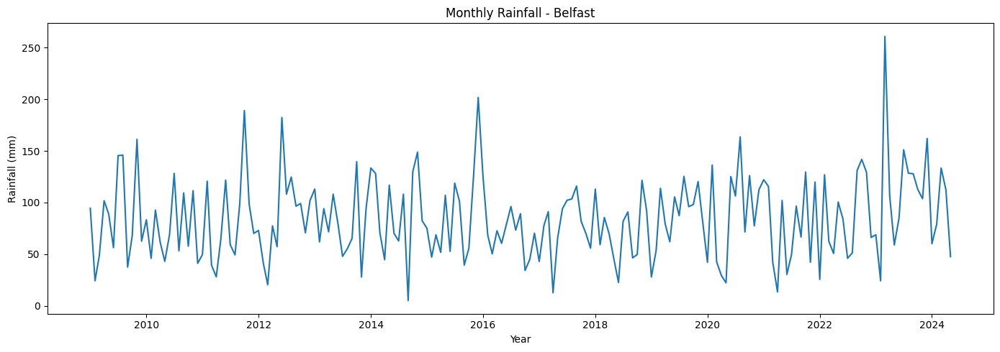
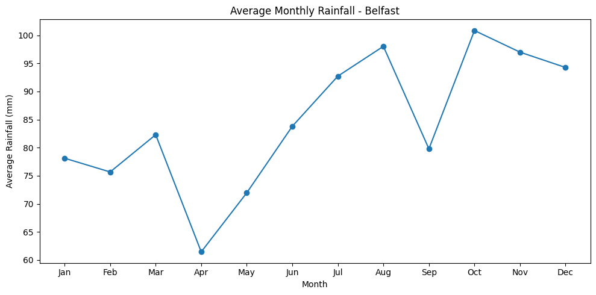
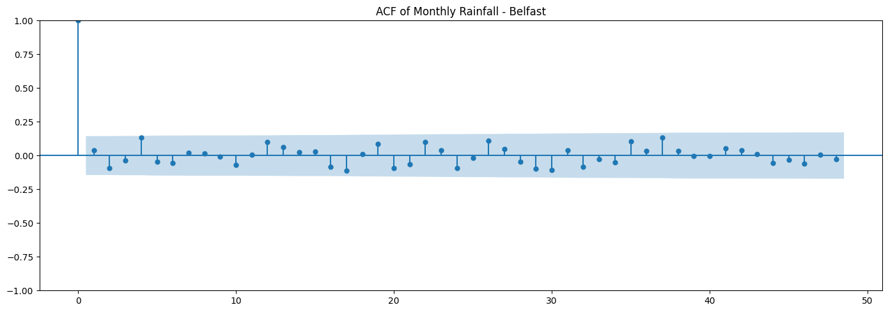
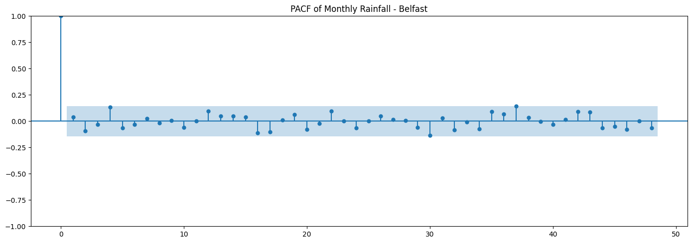
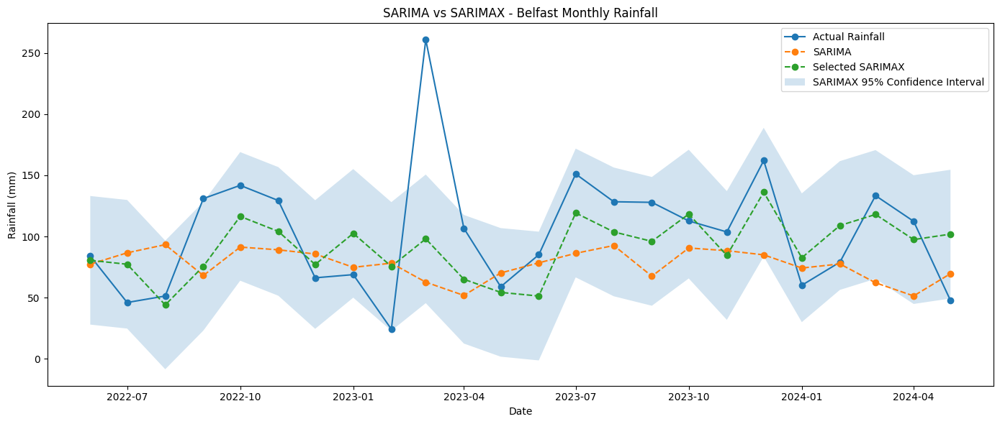
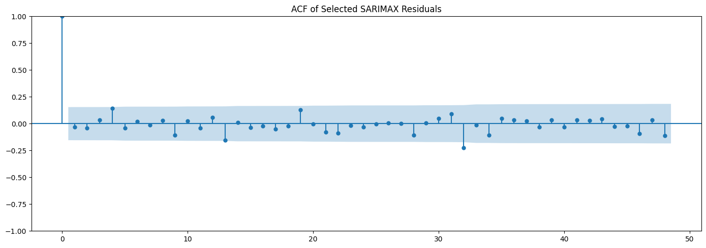

# Monthly Rainfall Forecasting with SARIMAX

A practical time-series forecasting project that evaluates whether **external meteorological variables improve monthly rainfall forecasts** beyond rainfall history and seasonality alone.

The study uses daily weather observations for **Belfast, UK**, aggregates them to monthly frequency, and compares a Seasonal Naive baseline, SARIMA, and SARIMAX.

## Main question

> **Do temperature, humidity, cloud cover, and wind information improve monthly rainfall forecasting compared with SARIMA alone?**

## SARIMAX concept

SARIMAX can be written as:

**SARIMAX (p, d, q) (P, D, Q, m) + X**

where the ARIMA/SARIMA terms describe temporal dependence and `X` contains exogenous predictors.

For this project:

- **Target `y`**: monthly rainfall
- **Exogenous `X`**: minimum temperature, maximum temperature, humidity, cloud cover, wind speed
- **Seasonal period `m`**: 12 months

## Dataset

The project uses the Kaggle **2M+ Daily Weather History UK** dataset.

Dataset page:

https://www.kaggle.com/datasets/jakewright/2m-daily-weather-history-uk

Only Belfast observations and the variables required for modeling are used.

### Final monthly series

- Location: Belfast
- Frequency: monthly
- Period: January 2009 – May 2024
- Complete monthly observations: 185
- Coverage rule: months require at least 90% observed rainfall days

The incomplete June 2024 month is excluded.

## Workflow

```text
Daily UK weather data
        ↓
Select Belfast
        ↓
Daily continuity check
        ↓
Monthly aggregation
        ↓
Coverage filtering
        ↓
Rainfall target y
+
Meteorological predictors X
        ↓
ADF + ACF/PACF
        ↓
Sub-training / validation / test split
        ↓
SARIMAX validation search
        ↓
Lock model specification
        ↓
Seasonal Naive vs SARIMA vs SARIMAX
        ↓
Final test evaluation
        ↓
Residual diagnostics
```

## Monthly rainfall



## Average rainfall by calendar month



The monthly averages vary through the year, supporting the use of a 12-month seasonal framework.

## Stationarity

The Augmented Dickey-Fuller test produced:

- ADF statistic: **-12.959**
- p-value: **3.25 × 10⁻²⁴**

The unit-root null is therefore rejected, supporting `d = 0` as the starting non-seasonal differencing order.

## ACF and PACF

### ACF



### PACF



These plots are used as diagnostics rather than as the sole basis for model selection.

## Evaluation design

The final 24 months are reserved as an untouched test set:

- Training: January 2009 – May 2022
- Test: June 2022 – May 2024

Inside the training period, the final 24 months are used for validation:

- Sub-training: January 2009 – May 2020
- Validation: June 2020 – May 2022

This keeps model selection separate from final test evaluation.

## SARIMAX validation

A compact grid tests:

- `p, q ∈ {0,1}`
- `P, D, Q ∈ {0,1}`
- `d = 0`
- `m = 12`
- a 5-variable and a reduced 4-variable exogenous set

The validation winner is:

**SARIMAX(1,0,1)(0,0,1,12)** with the 5-variable predictor set.

Validation performance:

- MAE: **23.32 mm**
- RMSE: **29.29 mm**

## Final test performance

| Model | MAE (mm) | RMSE (mm) |
|---|---:|---:|
| Seasonal Naive | 58.32 | 69.34 |
| SARIMA(1,0,1)(1,0,1,12) | 43.29 | 58.70 |
| **SARIMAX(1,0,1)(0,0,1,12)** | **31.80** | **44.36** |

Compared with SARIMA, the selected SARIMAX reduces:

- **MAE by 26.54%**
- **RMSE by 24.43%**

This is the main result: the exogenous meteorological variables provide substantial additional forecasting skill for this held-out period.

## SARIMA vs SARIMAX



## SARIMAX forecast with uncertainty


The model improves the general month-to-month forecast pattern, although unusual rainfall extremes remain difficult to reproduce.

## Residual diagnostics

The Ljung-Box test for the selected SARIMAX model gives:

| Lag | p-value |
|---:|---:|
| 12 | 0.818 |
| 24 | 0.769 |

Both p-values exceed 0.05, so no significant residual autocorrelation is detected at the tested seasonal lags.



## Exogenous-variable results

| Variable | Coefficient | p-value |
|---|---:|---:|
| Minimum temperature | -6.8774 | 0.6384 |
| Maximum temperature | 20.3396 | 0.1811 |
| Humidity | 11.4901 | 0.0024 |
| Cloud cover | 13.9848 | <0.001 |
| Wind speed | 15.0742 | <0.001 |

Humidity, cloud cover, and wind speed are statistically significant in the selected fitted model.

These coefficients describe associations within the forecasting model and should **not** be interpreted as causal effects.

## Why there is no unconditional future SARIMAX forecast

SARIMAX needs future exogenous values.

To forecast future rainfall, future values of temperature, humidity, cloud cover, and wind speed must also be supplied. Those inputs would need to be:

1. known in advance,
2. forecast separately, or
3. supplied as scenarios.

The held-out test experiment uses observed test-period `X` values to evaluate the **conditional predictive value** of the exogenous variables. It should not be confused with an unconditional operational future forecast.

## Repository structure

```text
sarimax-belfast-rainfall-forecasting/
│
├── README.md
├── requirements.txt
├── .gitignore
│
├── notebooks/
│   └── SARIMAX_Belfast_Rainfall_Forecasting.ipynb
│
├── figures/
│   ├── monthly_rainfall_time_series.png
│   ├── average_monthly_rainfall.png
│   ├── acf_rainfall.png
│   ├── pacf_rainfall.png
│   ├── train_test_split.png
│   ├── selected_sarimax_forecast_with_ci.png
│   ├── sarimax_residual_acf.png
│   └── sarima_vs_sarimax.png
│
└── results/
    ├── model_comparison.csv
    ├── validation_winner.csv
    ├── selected_model_metrics.csv
    ├── sarimax_exogenous_coefficients.csv
    └── sarimax_ljung_box.csv
```

## How to run

### Kaggle

1. Add the **2M+ Daily Weather History UK** dataset to a Kaggle notebook.
2. Upload the notebook from `notebooks/`.
3. Run all cells from top to bottom.

The notebook uses:

```python
DATA_PATH = "/kaggle/input/datasets/jakewright/2m-daily-weather-history-uk/all_weather_data.parquet"
```

### Local Jupyter

Install dependencies:

```bash
pip install -r requirements.txt
```

Download the Kaggle Parquet file and change `DATA_PATH` to its local path.

## Main learning outcomes

This project demonstrates that:

- SARIMAX extends SARIMA with external predictors.
- `y` and `X` play different roles in time-series forecasting.
- time-series validation must preserve chronological order.
- scaling must use training information only.
- AIC is not a substitute for out-of-sample validation.
- residual diagnostics should accompany MAE and RMSE.
- future SARIMAX forecasts require future exogenous inputs.

## Limitations

- The analysis uses one UK location.
- The SARIMA comparator is a fixed baseline specification rather than a separately tuned SARIMA model.
- Rainfall extremes remain difficult for the model.
- The fitted AR and MA terms are close to parameter boundaries, so coefficient-level interpretation should be cautious.
- Exogenous test-period values are observed values; operational future forecasting would require forecasts or scenarios for those predictors.
- Statistical significance does not establish causality.

## Technologies

`Python` · `pandas` · `PyArrow` · `Matplotlib` · `statsmodels` · `scikit-learn` · `Jupyter` · `Kaggle`

## Key takeaway

> **Adding meteorological exogenous variables improved Belfast monthly rainfall forecasting substantially compared with the rainfall-only SARIMA baseline.**
